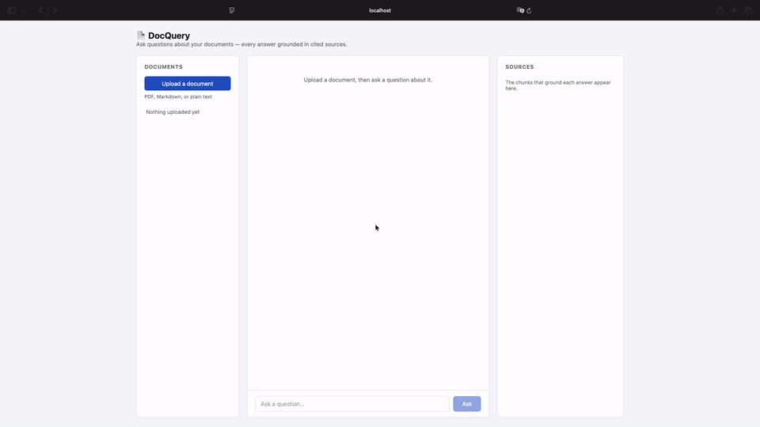
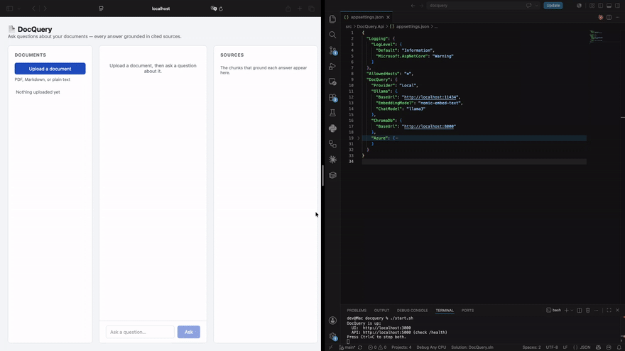
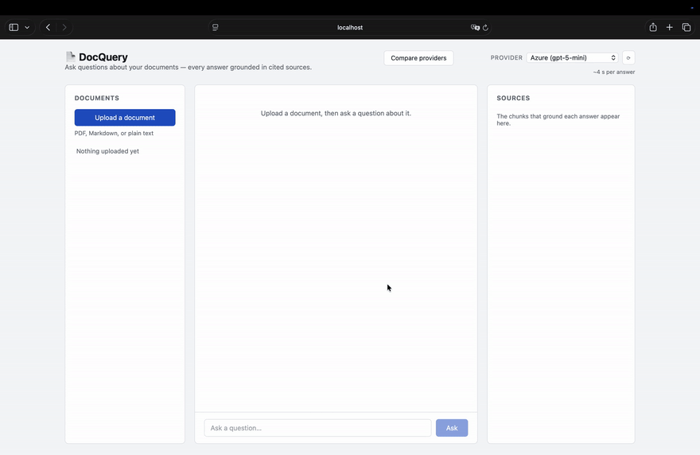
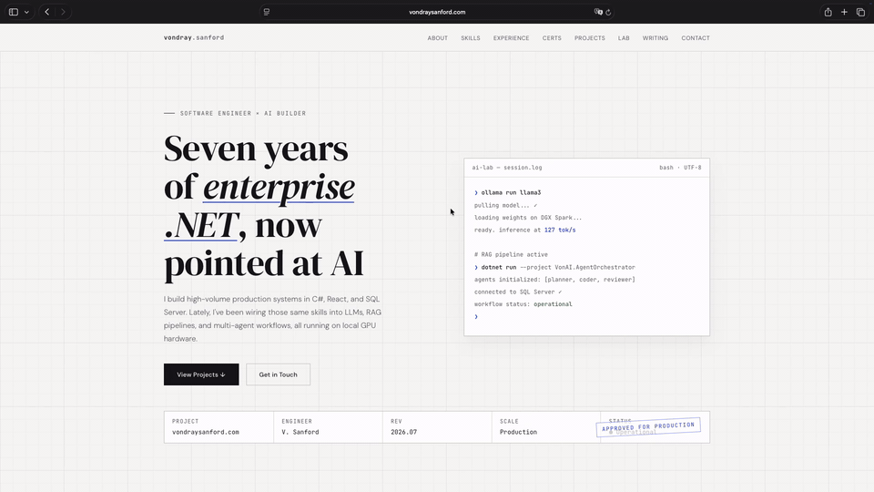

# 📄 DocQuery

**Ask natural language questions over your documents — powered by local LLMs or Azure OpenAI.**

DocQuery is a retrieval-augmented generation (RAG) application: upload technical documentation or study materials and query them in plain English, with every answer grounded in cited source chunks. Built with a C#/.NET 10 backend and React frontend, designed around a swappable provider architecture: fully local inference (Ollama + ChromaDB) or Azure AI services (Azure OpenAI + AI Search), selected by a single config value.

> **✅ Status: Phases 1–4 complete — [the live demo is up](https://docquery.vondraysanford.com). Phase 5 (daily tool & study mode) begins with OMSCS.**
> This README is the build plan as much as the documentation. Nothing is claimed as done unless its box is checked. Follow along: I'm building this in public.

---

## Why I'm Building This

I conceived DocQuery while studying for the Azure AI-102 exam (passed, June 2026) and kept running into the same gap: most RAG tutorials assume Python and a single hosted provider. As a .NET engineer moving deeper into AI, I wanted proof — for myself first — that you can build a production-quality RAG pipeline in the Microsoft ecosystem, and architect it so local inference and Azure AI services are interchangeable behind clean interfaces.

Now the study-partner use case has a new target: I'm starting Georgia Tech's OMSCS (Machine Learning specialization), and DocQuery will be loaded with course materials so I can quiz myself using my own pipeline. Building the tool, then studying with it.

---

## The Plan: Five Phases

| Phase | Theme | Outcome | Estimate |
|-------|-------|---------|----------|
| **1** | Make it work | A demoable local RAG app: upload → ask → cited answer | 2–3 weekends |
| **2** | Make it swappable | Provider pattern + Azure mode, benchmarked against local | 2 weekends |
| **3** | Make it feel great | Streaming, provider selector, side-by-side comparison | 2 weekends |
| **4** | Make it public | Live demo on vondraysanford.com, Azure-hosted 24/7 | 1–2 weekends |
| **5** | Make it mine | Hybrid search, collections, study mode for OMSCS | ongoing |

Each phase ends with something real: a demo, a benchmark table, a feature I use daily. No phase begins until the previous phase's "done when" is true.

---

## Phase 1 — Local RAG MVP

**Goal:** the smallest complete RAG loop, running entirely on local hardware, free, demoable offline. No provider abstraction yet — concrete classes, straight-line code.

- [x] .NET 10 Web API skeleton with health check endpoint
- [x] Document ingestion: PDF, Markdown, and plain-text upload → parse → chunk (fixed-size with overlap)
- [x] Embeddings via Ollama (`nomic-embed-text`)
- [x] Vector storage in ChromaDB (Docker container)
- [x] Query pipeline: embed question → top-k retrieval → context assembly → answer via Ollama (Llama 3) → response with source citations
- [x] React UI: upload panel, chat, and a sources pane showing exactly which chunks grounded each answer
- [x] Smoke tests for the ingestion and query paths
- [x] Demo GIF recorded and embedded below

**Done when:** a stranger can clone the repo, follow the Getting Started steps, upload a document, ask a question, and get a cited answer — and there's a GIF at the top of this README proving it.



---

## Phase 2 — Provider Pattern + Azure Mode

**Goal:** extract the abstraction Phase 1 deliberately skipped, then implement it twice. One config flag switches the entire stack between local and Azure.

- [x] Extract `IEmbeddingProvider`, `ILlmProvider`, and `IVectorStore` interfaces into `DocQuery.Core`; move Ollama/ChromaDB implementations into `DocQuery.Providers.Local` *(landed early, during Phase 1 — see Project Structure)*
- [x] `DocQuery.Providers.Azure`: Azure OpenAI (embeddings + chat) and Azure AI Search (vector store)
- [x] Provider switching via `appsettings.json` — no code changes to flip modes
- [x] Session-scoped conversation memory (follow-up questions keep context)
- [x] `docker-compose.yml` for one-command local stack
- [x] **Benchmarks:** fill the table below with real measurements

| Metric | Local (Llama 3 8B) | Local (Llama 3 70B) | Azure (gpt-5-mini) |
|--------|--------------------|---------------------|----------------|
| Inference speed (tok/s) | 57.4 | 5.8 | 85.2 |
| Embedding throughput (docs/min) | 287 | 120 | 152 |
| Average query latency | 2.4 s (p95 5.2 s) | 21.2 s (p95 45.7 s) | 4.3 s (p95 6.0 s) |
| Cost per 1K queries | $0 | $0 | ~$1.83 (estimated) |
| Answer quality (subjective notes) | 8.4/10 — all 10 answers correct; most complete on one question; boilerplate "according to the context" openers | 8.8/10 — all 10 correct; cleanest prose; 9× the latency bought no quality gain on this task | 9.0/10 — all 10 correct; best source attribution; minor stylistic artifacts |

<sup>Measured 2026-07-25 with `benchmarks/run_benchmark.py` over the `docs/samples/` corpus (10 questions × 2 passes, tok/s averaged over 3 runs). 8B ran on a MacBook M-series; 70B on an NVIDIA DGX Spark reached over an SSH tunnel; Azure in East US. Azure cost estimated from measured token usage × list prices, pending cross-check against billing actuals. Quality scores graded against the corpus from the saved answer files in `benchmarks/` — zero hallucinations from any provider; on factual retrieval over a small corpus the spread is narrow, and a harder synthesis-question rematch is queued for Phase 3.</sup>

**Done when:** the same UI runs against both stacks by changing one config value, and every cell in that table holds a measured number — the local-vs-Azure comparison is the most interesting output of this whole project.



---

## Phase 3 — UX

**Goal:** make DocQuery feel great to use — the polish that turns a working pipeline into something you'd happily demo.

- [x] Streaming responses (SSE: citations arrive before the answer starts, then token-by-token deltas from both providers — what makes the 70B's latency livable)
- [x] **Provider selector in the UI:** runtime switching between profiles (Local 8B, DGX Spark 70B, Azure) with health-checked availability, per-answer provider + latency attribution
- [x] Side-by-side provider comparison UI (same question, both stacks, answers side by side — streamed concurrently with per-answer latency)



**Done when:** answers stream, providers switch mid-conversation without a restart, and two stacks can race each other on screen — all verified in the browser.

---

## Phase 4 — Live Demo

**Goal:** put DocQuery on the public internet — a live demo linked from [vondraysanford.com](https://vondraysanford.com), Azure-hosted end-to-end so it's online 24/7.

- [x] UI deployed to Cloudflare Pages at [docquery.vondraysanford.com](https://docquery.vondraysanford.com) (static build, API origin via `VITE_API_BASE_URL`, auto-deploys on push)
- [x] API hosted in Azure for 24/7 availability — the public demo runs the **Azure provider end-to-end** (gpt-5-mini + AI Search), so it needs no Ollama or ChromaDB: one stateless container plus the resources that already exist *(Container Apps, scale-to-zero, image on GHCR)*
- [x] **Demo mode — "Ask my portfolio":** read-only over a seeded corpus about my work (resume, certifications, projects, open source contributions; a self-authored interview-Q&A bank joins as it's written) — recruiters ask questions, every answer cited back to the source *(live-verified: seeding idempotent, uploads 403, cited answers with conversation memory)*
- [x] Preset starter questions tuned for recruiters and hiring managers, one click away
- [x] Public-demo hardening: mutation endpoints disabled in demo mode, per-client rate limiting, question/output-token caps, keys regenerated post-launch; cloud secrets live only in Container Apps secret storage



**Done when:** a recruiter can click the demo link on my portfolio site any time of day, ask "what has Vondray actually built?", and get a cited answer.

The corpus grows over time — new documents and interview answers are a Dockerfile line and a rebuild away, and edited files re-ingest automatically on the next deploy (content fingerprinting).

---

## Phase 5 — Daily Tool & Study Mode

**Goal:** turn the deployed pipeline into the tool I reach for daily during OMSCS coursework.

- [ ] Hybrid search (keyword + semantic)
- [ ] Multi-document collections (per-course, per-topic)
- [ ] DOCX and HTML ingestion
- [ ] **Study mode (capstone):** generate flashcards and quiz questions from ingested documents

**Stretch ideas (beyond Phase 5):**
- Fine-tuned embedding model for domain-specific content
- Embedding the "Ask my portfolio" chat directly into the vondraysanford.com homepage (the Phase 3 demo links out to it; embedding it inline is the stretch)
- Spark-served variant of the public demo (Cloudflare Tunnel to home hardware, Tailscale for the dev path) — the $0-inference story, deliberately deprioritized in favor of always-online Azure

**Done when:** I've used study mode for a real OMSCS assignment, and the "What I'm Learning" section below has an honest entry for every phase.

---

## Architecture

As built and verified (Phases 1–2). One config value — `DocQuery:Provider` — selects which stack the app runs on; the interfaces in `DocQuery.Core` are the seam. Both paths are implemented, integration-tested against live services, and benchmarked above.

```
┌─────────────────────────────────────────────────────────┐
│                    React Frontend                       │
│               (Upload, Chat, Sources)                   │
└───────────────────────┬─────────────────────────────────┘
                        │ REST API
┌───────────────────────▼─────────────────────────────────┐
│                 .NET 10 Web API                         │
│                                                         │
│   Ingestion            Retrieval          Generation    │
│   • parsing            • embedding        • context     │
│   • chunking           • similarity       • LLM query   │
│   • storage            • ranking          • citations   │
│                            │                            │
│                  ┌─────────▼──────────┐                 │
│                  │   Provider Layer   │  selected by    │
│                  │   IEmbedding /     │  configuration  │
│                  │   ILlm / IVector   │                 │
│                  └────┬──────────┬────┘                 │
└───────────────────────┼──────────┼──────────────────────┘
                        │          │
        ┌───────────────▼──────┐  ┌▼────────────────────────┐
        │        LOCAL         │  │         AZURE           │
        │ Ollama               │  │ Azure OpenAI            │
        │  nomic-embed-text    │  │  text-embedding-3-small │
        │  Llama 3 (8B–70B)    │  │  gpt-5-mini             │
        │ ChromaDB (Docker)    │  │ Azure AI Search         │
        └─────┬────────────────┘  └─────────────────────────┘
              │                        ☁️ Azure Cloud
   ┌──────────▼─────────────────┐
   │ MacBook (8B dev) or        │
   │ DGX Spark (70B, 128 GB     │
   │ unified memory) via config │
   └────────────────────────────┘
```

---

## Tech Stack

| Layer | Phase 1 (Local) | Phase 2 adds (Azure mode) |
|-------|-----------------|---------------------------|
| Frontend | React, JavaScript, CSS | — |
| Backend API | C# / .NET 10, ASP.NET Core | provider interfaces in `DocQuery.Core` |
| Vector store | ChromaDB (Docker) | Azure AI Search |
| Embeddings | Ollama (`nomic-embed-text`) | Azure OpenAI (`text-embedding-3-small`) |
| LLM inference | Ollama (Llama 3 — 8B for dev, 70B fits on the Spark) | Azure OpenAI (`gpt-5-mini`) |
| Hardware | NVIDIA DGX Spark (128 GB unified memory) | Azure (free tier / pay-as-you-go) |

---

## Getting Started (Phase 1 — Local Mode)

Azure setup instructions will be added when Phase 2 lands. Everything below runs free on your own hardware.

### Prerequisites

- [.NET 10 SDK](https://dotnet.microsoft.com/download/dotnet/10.0)
- [Node.js 22 LTS or newer](https://nodejs.org/) (the UI's build tool, Vite 8, requires Node ≥ 20.19)
- [Docker](https://www.docker.com/) (for ChromaDB)
- [Ollama](https://ollama.ai/) installed and running (any Ollama-capable machine works; a GPU helps)

### 1. Clone and configure

```bash
git clone https://github.com/vondraysanford/docquery.git
cd docquery
cp src/DocQuery.Api/appsettings.example.json src/DocQuery.Api/appsettings.json
```

```json
{
  "DocQuery": {
    "Ollama": {
      "BaseUrl": "http://localhost:11434",
      "EmbeddingModel": "nomic-embed-text",
      "ChatModel": "llama3"
    },
    "ChromaDb": {
      "BaseUrl": "http://localhost:8000"
    }
  }
}
```

### 2. Start dependencies

```bash
ollama pull llama3
ollama pull nomic-embed-text
```

**One-command stack (Docker Compose):** with the Ollama app running, this builds and starts ChromaDB, the API, and the UI together — then open `http://localhost:3000`:

```bash
docker compose up --build
```

The API is published on host port 5050 (macOS AirPlay occupies 5000), ChromaDB's vectors persist in a named volume across container restarts, and Ollama deliberately stays on the host so it can use the GPU. Prefer running things directly? Steps 3–4 below are the non-Docker dev path (start ChromaDB alone with `docker compose up -d chromadb`).

### 3. Run the backend

```bash
cd src/DocQuery.Api
dotnet restore
dotnet run
```

The API listens on `http://localhost:5000` — verify with `curl http://localhost:5000/health`, which should return `{"status":"healthy"}`.

### 4. Run the frontend

```bash
cd src/docquery-ui
npm install
npm start
```

Open `http://localhost:3000`, upload a PDF or Markdown file, and ask it something. (The UI dev server proxies `/api` requests to the backend on port 5000 — no extra configuration needed.)

Need a document to try? The repo ships a small sample corpus in [`docs/samples/`](docs/samples/) — my resume, project notes, and certification history. Upload a file or two and ask things like *"What Azure experience does Vondray have?"* or *"Why was DocQuery built in C# instead of Python?"* — the sources pane will show exactly which chunks grounded the answer.

**Shortcut:** once dependencies are installed, `./start.sh` from the repo root runs steps 3 and 4 together in one terminal — Ctrl+C stops both.

### 5. (Optional) Run the smoke tests

```bash
dotnet test tests/DocQuery.Api.Tests
```

The tests use fake providers, so they pass without Ollama, ChromaDB, or Docker running.

### Using a remote Ollama host (e.g., an NVIDIA DGX Spark)

Nothing network-related is hardcoded: point the config at any machine running Ollama and DocQuery uses it for both embeddings and chat. The remote host needs both models pulled (`ollama pull nomic-embed-text` plus your chat model). For a box that shouldn't expose Ollama's port — it has **no authentication or TLS of its own**, so treat it like a database port — tunnel over SSH instead of binding it to the network:

```bash
# Forward local port 11435 to the remote machine's Ollama
ssh -N -L 11435:localhost:11434 you@your-inference-box
```

```json
"Ollama": {
  "BaseUrl": "http://localhost:11435",
  "EmbeddingModel": "nomic-embed-text",
  "ChatModel": "llama3:70b"
}
```

This is exactly how the benchmark table's 70B column was measured — `benchmarks/run_benchmark.py` documents the ready-made invocation.

---

## Project Structure

```
docquery/
├── src/
│   ├── DocQuery.Api/               # ASP.NET Core Web API — controllers, file parsing, composition root
│   │   ├── Controllers/            #   DocumentsController (ingestion), QueryController (RAG loop)
│   │   ├── Services/               #   DocumentTextExtractor (PDF via PdfPig, Markdown/text)
│   │   └── Program.cs
│   ├── DocQuery.Core/              # Interfaces (IEmbeddingProvider, ILlmProvider, IVectorStore),
│   │                               #   domain models, ChunkingService
│   ├── DocQuery.Providers.Local/   # Ollama (embeddings + chat) and ChromaDB implementations
│   ├── DocQuery.Providers.Azure/   # Phase 2: Azure OpenAI + AI Search (stubs, not yet referenced)
│   └── docquery-ui/                # React frontend (Vite) — upload, chat, sources pane
├── tests/
│   └── DocQuery.Api.Tests/         # Smoke tests — fake providers, no services required
├── docs/                           # Demo GIF, architecture notes
├── docker-compose.yml              # One-command stack: ChromaDB + API + UI (Ollama stays on host)
├── start.sh                        # Runs API + UI together for local dev (no containers)
└── README.md
```

The interface/provider split emerged during Phase 1 rather than waiting for Phase 2: the contracts live in `DocQuery.Core`, the Ollama/ChromaDB implementations in `DocQuery.Providers.Local`. What remains for Phase 2 is implementing the same interfaces against Azure (`DocQuery.Providers.Azure` is stubbed but deliberately unreferenced) and the config flag that swaps the stacks.

---

## What I'm Learning

Updated at the end of each phase — honest notes on what was harder than expected, what I'd do differently, and what the tutorials don't tell you.

- **Phase 1:** _pending_
- **Phase 2:** _pending — including the local-vs-Azure quality/cost/latency verdict_
- **Phase 3:** _pending_
- **Phase 4:** _pending_
- **Phase 5:** _pending_

---

## Related

- Blog: posts on this build will appear at [vondraysanford.com](https://vondraysanford.com)
- Portfolio: [vondraysanford.com](https://vondraysanford.com)

---

## License

MIT

---

**Built by [Vondray Sanford](https://www.linkedin.com/in/vondray-sanford/)** — .NET engineer building at the intersection of enterprise systems and modern AI.
